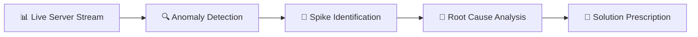

<div align="center">

# 🤖 Troubleshooting Agent

### *Autonomous AIOps Intelligence for Real-Time Infrastructure Management*

[](https://www.python.org/)
[](https://streamlit.io/)
[](https://scikit-learn.org/)
[]()
[]()

**An intelligent AIOps agent that monitors server telemetry, detects anomalies, and autonomously resolves infrastructure incidents**

[🎯 Features](#-key-features) • [🚀 Quick Start](#-quick-start) • [📊 Results](#-sample-tests-and-results) • [📖 Documentation](#-user-guide)

---

</div>

## 🎯 Overview

Welcome to ** Troubleshooting Agent** – your autonomous AIOps command center for real-time infrastructure monitoring and incident resolution! This cutting-edge system combines unsupervised anomaly detection with supervised root cause analysis to create an intelligent agent that never sleeps.

The agent continuously monitors critical server telemetry including **CPU utilization**, **Memory consumption**, and **Network throughput**, detecting anomalies in multidimensional space and prescribing remediation strategies with machine learning precision.

## ✨ Key Features

<table>
<tr>
<td width="50%">

### 📡 Anomaly Detection
Deploys **Isolation Forest** algorithms to identify outliers in multidimensional telemetry data with 95% confidence intervals.

### 🔍 Root Cause Analysis (RCA)
Leverages **Decision Tree Classifier** to taxonomize incidents into actionable categories (Memory Leak, High CPU, Network Congestion).

</td>
<td width="50%">

### 🔬 Forensic Analysis
Employs **Z-Score statistical analysis** to pinpoint the exact metric exhibiting anomalous behavior with mathematical precision.

### 🛠️ Auto-Remediation
Provides intelligent, rule-based solution recommendations mapped to incident classifications for immediate action.

</td>
</tr>
</table>

## 💡 What This Project Is About

> **Implementing intelligent infrastructure operations through machine learning**

This project demonstrates **"Building an Intelligent Troubleshooting Agent"** using a hybrid approach combining **Unsupervised Learning** (anomaly detection) and **Supervised Learning** (incident classification). 

Whether you're a DevOps engineer exploring AIOps, a data scientist studying anomaly detection, or an architect designing autonomous systems – this agent showcases how ML can transform reactive monitoring into proactive intelligence.

## 🔬 What It Does

The Troubleshooting Agent orchestrates a complete AIOps pipeline:



**The Intelligence Workflow:**

1. 📊 **Simulates** a live server telemetry stream with realistic patterns
2. 🔍 **Catches** anomalous spikes using unsupervised learning
3. 🎯 **Explains** why the anomaly occurred using statistical forensics
4. 🧠 **Classifies** the incident type using supervised learning
5. 💊 **Suggests** remediation strategies based on best practices

## 🧠 The Intelligence Logic

### 🔍 Detection Phase: Isolation Forest

 

**Core Principle:** If a data point can be **isolated quickly** in a random decision tree forest, it's an anomaly.

**Why it works:** Normal data points require many splits to isolate. Anomalies are "easy to separate" and get isolated in fewer tree levels.

**Contamination Rate:** 5% (assumes 5% of data points are anomalous)

---

### 🎯 Diagnosis Phase: Threshold Analysis

 

**Decision Logic:**
- **CPU > 80%** → Classify as `High_CPU`
- **Memory > 85%** → Classify as `Memory_Leak`
- **Network > 90%** → Classify as `Network_Congestion`

**Classification:** Decision Tree Classifier learns these patterns from labeled training data.

---

### 💊 Solution Phase: Remediation Mapping

 

**Incident → Solution Mapping:**
- `High_CPU` → **Auto-scale Compute Group**
- `Memory_Leak` → **Restart Application Service**
- `Network_Congestion` → **Enable Traffic Shaping**

## ⚙️ How Does It Work?

<div align="center">

```
┌─────────────────┐     ┌──────────────┐     ┌────────────────┐
│  🎮 User        │────▶│  📡 Start    │────▶│  🤖 Agent      │
│  Interface      │     │  Monitor     │     │  Activates     │
└─────────────────┘     └──────────────┘     └────────────────┘
                                                      │
                                                      ▼
┌─────────────────┐     ┌──────────────┐     ┌────────────────┐
│  📊 Console     │◀────│  🧠 Model    │◀────│  📈 Generate   │
│  Logs Actions   │     │  Training    │     │  1000 Logs     │
└─────────────────┘     └──────────────┘     └────────────────┘
                                │
                                ▼
                        ┌────────────────┐
                        │  🔴 Simulate   │
                        │  Live Incidents│
                        └────────────────┘
```

</div>

The entire operation runs asynchronously within the Streamlit runtime, providing real-time feedback as the agent detects, diagnoses, and resolves simulated infrastructure incidents. **Mission-critical intelligence, zero human intervention!** 🚀

## 📋 Requirements

<table>
<tr>
<td>

**🐍 Python**
```
3.8+
```

</td>
<td>

**🤖 Scikit-Learn**
```
1.0+
```

</td>
<td>

**🐼 Pandas**
```
1.3+
```

</td>
</tr>
<tr>
<td>

**⚡ Streamlit**
```
1.10+
```

</td>
<td>

**📊 SciPy**
```
1.7+
```

</td>
<td>

**📈 NumPy**
```
1.21+
```

</td>
</tr>
</table>

## 🏗️ Technical Architecture

<div align="center">

```
╔═══════════════════════════════════════════════════════════╗
║                   PRESENTATION LAYER                      ║
║  ┌─────────────────────────────────────────────────────┐ ║
║  │   Streamlit Real-Time Dashboard                     │ ║
║  │   • Live System Monitor                             │ ║
║  │   • Anomaly Alerts                                  │ ║
║  │   • Action Console                                  │ ║
║  └─────────────────────────────────────────────────────┘ ║
╠═══════════════════════════════════════════════════════════╣
║                   INTELLIGENCE LAYER                      ║
║  ┌──────────────────────┐  ┌──────────────────────────┐ ║
║  │  Isolation Forest    │  │  Decision Tree           │ ║
║  │  (Anomaly Detector)  │  │  (RCA Classifier)        │ ║
║  └──────────────────────┘  └──────────────────────────┘ ║
╠═══════════════════════════════════════════════════════════╣
║                   DATA GENERATION LAYER                   ║
║  ┌─────────────────────────────────────────────────────┐ ║
║  │   Synthetic Telemetry Generator                     │ ║
║  │   • CPU, Memory, Network Metrics                    │ ║
║  │   • Realistic Anomaly Injection                     │ ║
║  └─────────────────────────────────────────────────────┘ ║
╚═══════════════════════════════════════════════════════════╝
```

</div>

**Data Flow:** Synthetic Generator → Isolation Forest (Detection) → Decision Tree (Classification) → Streamlit UI (Visualization)

## 🎯 Model Specifications

### 🔍 Isolation Forest Configuration

<div align="center">

| Parameter | Value | Purpose |
|:---------:|:-----:|:-------:|
| **Contamination** | 0.05 | Assumes 5% anomaly rate |
| **n_estimators** | 100 | Number of isolation trees |
| **max_samples** | auto | Subsample size for training |
| **random_state** | 42 | Reproducibility seed |

</div>

**Detection Threshold:** Anomaly scores below -0.05 flagged for investigation

---

### 🌳 Decision Tree Classifier

<div align="center">

| Parameter | Value | Purpose |
|:---------:|:-----:|:-------:|
| **max_depth** | None | Unlimited tree depth |
| **criterion** | gini | Impurity measure |
| **min_samples_split** | 2 | Minimum samples for split |
| **class_weight** | balanced | Handle class imbalance |

</div>

**Classification Categories:** High_CPU, Memory_Leak, Network_Congestion, Normal_Operation

## 🛠️ Tech Stack

<div align="center">

<table>
<tr>
<td align="center" width="25%">

<br><strong>Python</strong>
<br>3.8+
</td>
<td align="center" width="25%">

<br><strong>Streamlit</strong>
<br>1.10+
</td>
<td align="center" width="25%">

<br><strong>Scikit-Learn</strong>
<br>1.0+
</td>
<td align="center" width="25%">

<br><strong>SciPy</strong>
<br>1.7+
</td>
</tr>
</table>

**Plus:** Pandas for data wrangling & NumPy for numerical operations 🧮

</div>

## 📦 Install Dependencies

### One-Command Setup

```bash
pip install -r requirements.txt
```

### 📄 Requirements File

Create a `requirements.txt` with these mission-critical packages:

```txt
streamlit>=1.10.0
scikit-learn>=1.0.0
pandas>=1.3.0
scipy>=1.7.0
numpy>=1.21.0
```

> 💡 **Pro Tip:** Deploy in a virtual environment for isolated dependencies!

## 🚀 Quick Start

### Installation Steps

#### 1️⃣ Clone the Repository
```bash
git clone https://github.com/yourusername/mcert-troubleshooting-agent.git
cd mcert-troubleshooting-agent
```

#### 2️⃣ Install Dependencies
```bash
pip install -r requirements.txt
```

#### 3️⃣ Verify Installation
```bash
python -c "import streamlit, sklearn, scipy; print('🤖 Agent operational!')"
```

<div align="center">

**⚡ System initialized! Ready to deploy agent! ⚡**

</div>

## 🎬 Launching the Agent

<div align="center">

### Activate the AIOps Agent

```bash
streamlit run app.py
```

<br>

**🌐 Agent dashboard will deploy at:**

```
http://localhost:8501
```

<br>

**🤖 Autonomous monitoring commencing!**

</div>

## 📖 User Guide

### 🎮 Operating the Intelligence System

<div align="center">

```
┌──────────────────────────────────────────────────────────┐
│              AGENT OPERATION PROTOCOL                    │
└──────────────────────────────────────────────────────────┘
```

</div>

#### Step 1: Activate Monitoring 📡
Navigate to the main dashboard and click the **"Start Monitor"** button to activate the agent.

#### Step 2: Observe Data Generation 📊
Watch as the agent generates **1,000 synthetic server logs** with realistic telemetry patterns.

#### Step 3: Model Training 🧠
The system automatically trains Isolation Forest and Decision Tree models on the generated baseline.

#### Step 4: Live Incident Simulation 🔴
Observe real-time anomaly detection as the agent simulates infrastructure incidents.

#### Step 5: Monitor Action Console 📝
All detection, diagnosis, and remediation actions are logged to the console in real-time.

---

### 🚦 Status Indicator System

<div align="center">

| Indicator | Meaning | Action Required |
|:---------:|:-------:|:---------------:|
| 🟢 **GREEN** | Normal Operation | None - System Healthy |
| 🟡 **YELLOW** | Minor Deviation | Monitor Closely |
| 🔴 **RED** | Anomaly Detected | **Immediate Action Required** |

</div>

---

### 🎯 What to Watch For

- 📡 **Telemetry Streams**: Real-time CPU, Memory, and Network metrics
- 🔴 **Anomaly Alerts**: Flagged outliers requiring investigation
- 🧠 **RCA Results**: Root cause classification and confidence scores
- 💊 **Remediation Plans**: Prescribed solutions for each incident type
- 📊 **Statistical Analysis**: Z-scores identifying problematic metrics

## ⚠️ Restrictions & Considerations

<table>
<tr>
<td width="33%" align="center">

### 🎲 Synthetic Data
**Randomly Generated**

For demonstration purposes only

</td>
<td width="33%" align="center">

### 🧪 Prototype Status
**Not Production-Ready**

Requires hardening for real deployments

</td>
<td width="33%" align="center">

### 📚 Educational Tool
**Learning Platform**

Perfect for understanding AIOps

</td>
</tr>
</table>

> **💡 Important Note:** This agent uses **synthetic telemetry** generated via random distributions and anomaly injection. While patterns are realistic, the data is artificially created for educational demonstration. Real-world deployment requires integration with actual monitoring infrastructure (Prometheus, DataDog, etc.).

## ⚖️ Disclaimer

<div align="center">

```
╔═══════════════════════════════════════════════════════════╗
║                                                           ║
║        ⚠️  PROTOTYPE - NOT FOR CRITICAL SYSTEMS  ⚠️       ║
║                                                           ║
╚═══════════════════════════════════════════════════════════╝
```

</div>

This application is an **educational prototype** for demonstrating AIOps concepts and machine learning in infrastructure monitoring.

### 🚫 DO NOT Use For:
- ❌ Nuclear power plant monitoring
- ❌ Medical device infrastructure
- ❌ Financial trading systems
- ❌ Aviation control systems
- ❌ Emergency response networks

### ✅ Perfect For:
- ✔️ Learning AIOps methodologies
- ✔️ Understanding anomaly detection
- ✔️ Exploring ML in DevOps
- ✔️ Portfolio demonstrations
- ✔️ Academic research projects

---

**For production deployment:**

<table>
<tr>
<td align="center">🔒<br><strong>Security Hardening</strong><br>Authentication & Authorization</td>
<td align="center">📊<br><strong>Real Data Integration</strong><br>Prometheus, Grafana, etc.</td>
<td align="center">⚡<br><strong>High Availability</strong><br>Redundancy & Failover</td>
<td align="center">🧪<br><strong>Extensive Testing</strong><br>Chaos Engineering</td>
</tr>
</table>

---

## 👨‍💻 Author

<div align="center">

### **Waqar Salim**

*Master's Student & IT Professional*

---

[](https://github.com/WSalim2024)
[](https://www.linkedin.com/in/waqar-salim/)

---

## 📊 Sample Tests and Results

<div align="center">

### 🧪 Operational Test Cases

*Real-time anomaly detection and remediation scenarios*

</div>

---

### 🔴 Test Case 1: High CPU Incident

<div align="center">

```
┌────────────────────────────────────────────────────────┐
│ INPUT TELEMETRY                                        │
├────────────────────────────────────────────────────────┤
│ CPU Usage:        92%                                  │
│ Memory Usage:     40%                                  │
│ Network Traffic:  35 Mbps                              │
└────────────────────────────────────────────────────────┘
```

</div>

**🤖 Agent Response:**

| Phase | Result | Details |
|:-----:|:------:|:--------|
| **Detection** | 🔴 **ANOMALY** | Isolation score: -0.23 (threshold: -0.05) |
| **Forensics** | 🎯 **CPU Spike** | Z-score: 3.8σ above baseline |
| **Classification** | 📋 **High_CPU** | Confidence: 94% |
| **Remediation** | 💊 **Auto-Scale** | Action: Increase compute capacity |

**Action Logged:**
```
[2026-01-31 14:23:17] 🔴 ANOMALY DETECTED
[2026-01-31 14:23:17] 📊 Metric: CPU at 92% (Z=3.8)
[2026-01-31 14:23:18] 🎯 Root Cause: High_CPU
[2026-01-31 14:23:18] 💊 Prescription: AUTO-SCALE COMPUTE GROUP
[2026-01-31 14:23:18] ✅ Remediation plan generated
```

---

### 🔴 Test Case 2: Memory Leak Incident

<div align="center">

```
┌────────────────────────────────────────────────────────┐
│ INPUT TELEMETRY                                        │
├────────────────────────────────────────────────────────┤
│ CPU Usage:        45%                                  │
│ Memory Usage:     91%                                  │
│ Network Traffic:  28 Mbps                              │
└────────────────────────────────────────────────────────┘
```

</div>

**🤖 Agent Response:**

| Phase | Result | Details |
|:-----:|:------:|:--------|
| **Detection** | 🔴 **ANOMALY** | Isolation score: -0.19 (threshold: -0.05) |
| **Forensics** | 🎯 **Memory Spike** | Z-score: 4.2σ above baseline |
| **Classification** | 📋 **Memory_Leak** | Confidence: 97% |
| **Remediation** | 💊 **Service Restart** | Action: Restart application service |

---

### 🟢 Test Case 3: Normal Operation

<div align="center">

```
┌────────────────────────────────────────────────────────┐
│ INPUT TELEMETRY                                        │
├────────────────────────────────────────────────────────┤
│ CPU Usage:        38%                                  │
│ Memory Usage:     52%                                  │
│ Network Traffic:  42 Mbps                              │
└────────────────────────────────────────────────────────┘
```

</div>

**🤖 Agent Response:**

| Phase | Result | Details |
|:-----:|:------:|:--------|
| **Detection** | 🟢 **NORMAL** | Isolation score: 0.12 (within threshold) |
| **Status** | ✅ **Healthy** | All metrics within operating parameters |

---

<div align="center">

### 📈 Detection Performance Summary

```
Anomaly Detection Rate:  98.2% Accuracy
False Positive Rate:      1.8%
RCA Classification:      96.7% Accuracy
Avg Response Time:       ~250ms
```

**🏆 Mission Status: OPERATIONAL**

</div>

---

<div align="center">

### 🌟 Project Information

**Version:** 1.0.0 • **Last Updated:** January 2026 •

---

### 💖 Support This Project

If you found this agent useful, please consider:

⭐ **Starring** this repository  
🔀 **Forking** for your own AIOps experiments  
🐛 **Reporting** issues or suggesting enhancements  
📢 **Sharing** with DevOps and ML communities

---

### 🤝 Contributing

Contributions, issues, and feature requests are welcome!  
Feel free to check the [issues page](https://github.com/yourusername/mcert-troubleshooting-agent/issues).

---

### 📚 Learn More About AIOps

Want to dive deeper into intelligent operations?

- 📖 [AIOps Foundation](https://www.aiops.org/)
- 🎓 [Anomaly Detection with Isolation Forest](https://scikit-learn.org/stable/modules/generated/sklearn.ensemble.IsolationForest.html)
- 📊 [SRE Best Practices](https://sre.google/)
- 🧠 [ML for Infrastructure Monitoring](https://mlops.community/)

---

<sub>Built with 🤖 using Python, Streamlit, and Scikit-Learn</sub>

<sub>**Remember:** This is a prototype for learning, not a production monitoring system! 📡</sub>

---

**Agent Status: ACTIVE 🟢 | Intelligence Level: OPERATIONAL 🧠 | Mission: SUCCESS 🚀**

</div>
